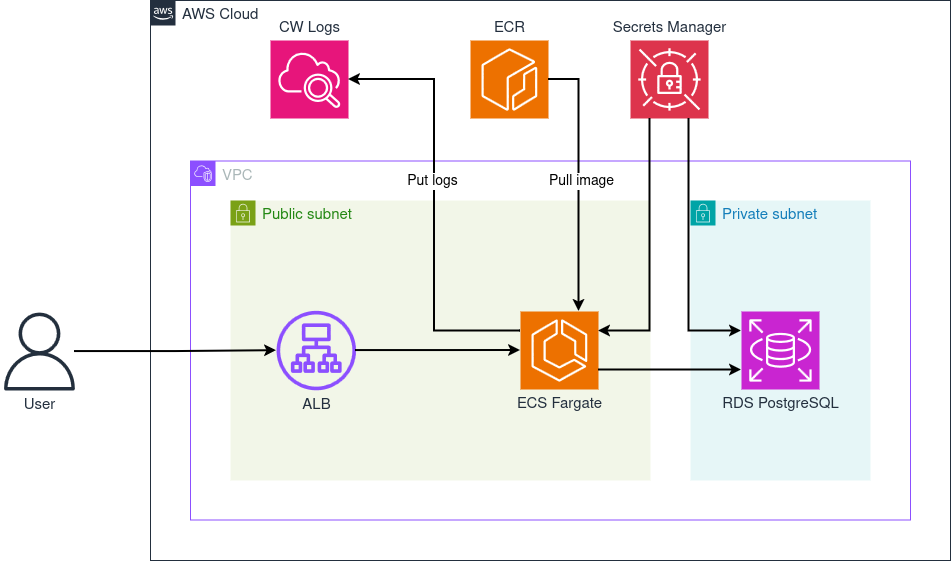

# Restaurant Reservation Service

Minimal backend for restaurants reservation management system

## Requirements
- Java 21+
- Spring Boot 3.5+
- Docker (for local testing)
- Terraform

## API (HTTP)
- `GET /restaurants` – list restaurants
- `GET /restaurants/{restaurantId}` – fetch restaurant
- `POST /restaurants/` – create
- `PUT /restaurants/{restaurantId}` – update
- `GET /restaurants/{restaurantId}/availability?date=YYYY-MM-DD` – check availability
- `GET /restaurants/{restaurantId}/reservations?date=YYYY-MM-DD` – list reservations
- `POST /reservations` – create reservation
- `GET /reservations/{reservationId}` – fetch reservation
- `POST /reservations/{reservationId}/cancel` – cancel
- `POST /reservations/{reservationId}/status` – update status
- `GET /actuator/health` – health check

## Local development
1) Start Postgres (local compose provided):
   ```
   docker compose -f src/test/resources/docker/docker-compose.yaml up -d
   ```
   Apply the schema if needed:
   ```
   psql -h localhost -p 15432 -U test -d restaurant-reservation -f src/test/resources/sql/create-table.sql
   ```
   Adminer is available at port 18080
2) Run the app:
   ```
   ./gradlew bootRun
   ```

## Tests
Tests expect Postgres on `localhost:15432` with the schema above. Run:
```sh
./gradlew test
```

## Docker
The Dockerfile runs tests during build. Ensure the local DB is reachable or skip tests locally. Build and tag (example):
```sh
docker build -t <ecr repo uri>:<tag> .
```

## Infrastructure (AWS)

